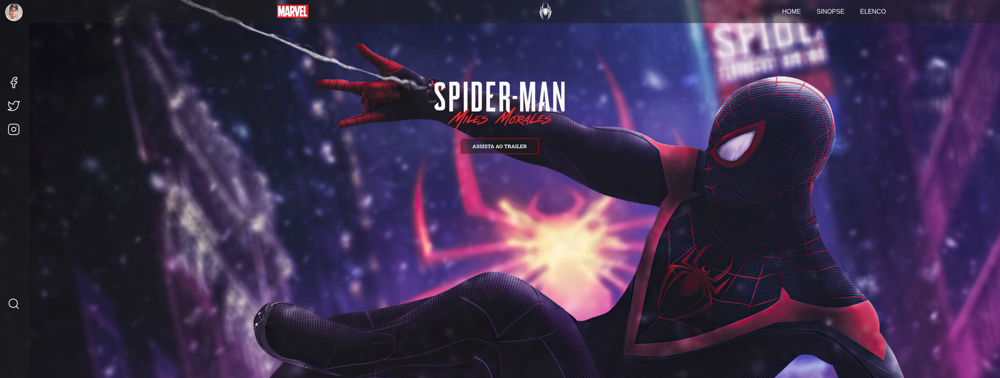

<h1 align="center">Spider-Man</h1>

  

## 💻 Projeto

O protótipo desse website foi desenvolvido pelo [**Iuri Silva**](https://www.iuricode.com/), [clique aqui](https://www.figma.com/file/Yb9IBH56g7T1hdIyZ3BMNO/Desafios---Codel%C3%A2ndia?node-id=39936%3A781) para abrir o protótipo no figma.

Dependências usadas no projeto:

-  [HTML 5](https://developer.mozilla.org/pt-BR/docs/Web/HTML)
-  [CSS](https://developer.mozilla.org/pt-BR/docs/Web/CSS)
-  [JavaScript](https://developer.mozilla.org/pt-BR/docs/Web/JavaScript)
